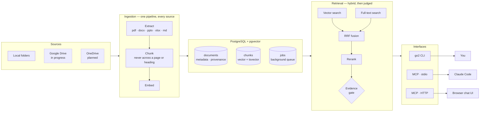

# Go2Assistant

Ask questions about your own documents and get answers with citations back to the exact page or section — or a straight *"the documents do not say"* when the evidence is not there.

```bash
go2 ingest ~/Documents/work
go2 search "how much did we agree to pay Acme?"
```

```
1. Acme Master Services Agreement.pdf p.1   [1.01]
   The annual renewal fee is 4,500 USD, payable each March...
```

Retrieval is exposed as MCP tools, so Claude Code — or any chat UI — becomes the interface.

---

## Components



Every row carries a workspace id, and every query filters on it. `go2 tenant` creates isolated workspaces that cannot see each other's documents.

**Providers sit behind interfaces.** Embedding and reranking run on-device (nothing leaves the machine) or through the Jina API (roughly 9× faster, and the laptop stays idle). One config line switches them.

---

## How it works

**Agentic search, not single-shot RAG.** Retrieval is three tools and the model drives the loop — rephrasing a bad query, fetching more of a document, filtering on metadata. *"Which contracts expire this quarter?"* is a metadata question no vector search can answer.

**Hybrid search, never vector-only.** Exact identifiers — invoice numbers, client names — are what embeddings are worst at and what people actually search for. Vector and full-text results are fused by Reciprocal Rank Fusion, then reranked.

**An answer must clear a floor.** Below it, passages are reported as *not evidence* rather than dressed up as an answer. Refusing is a feature; a confident wrong answer costs more than no answer.

**Citations are load-bearing.** Chunks never merge across a page, slide, or heading. A chunk spanning pages 3 and 4 can only be cited as one of them, and a citation pointing at the wrong page is worse than a smaller chunk.

**Spreadsheets are never chunked as prose.** Each sheet is kept whole — prose-chunking a budget destroys exactly the numbers the question is about.

**Nothing leaves the machine unscreened.** With a hosted provider, every chunk of every document is sent at ingest — far more surface than a chat message. One egress boundary screens all of it. Detection is checksum-validated, so a sixteen-digit run identifier is not mistaken for a card number.

**Vectors carry their provenance.** Embeddings from different models are not comparable, and mixing them fails silently. Each document records the model that produced it, and search scopes to the active one.

---

## Commands

| | |
|---|---|
| `go2 ingest PATH` | Index a folder (`--background` to queue it) |
| `go2 worker` | Drain the ingestion queue |
| `go2 search "..."` | Query from the terminal |
| `go2 tenant list` | Workspaces, and what each holds |
| `go2 docs` | Every ingested file (`--by-folder` to group) |
| `go2 status` | What is indexed, and which model embedded it |
| `go2 scan PATH` | Report sensitive values *before* indexing |
| `go2 evaluate` | Run `eval/questions.yaml`, report rank and MRR |
| `go2 trace` | Per-component steps of recent requests, egress marked |
| `go2 serve` | MCP server on stdio |
| `go2 serve --http` | ...over Streamable HTTP, for a chat UI |

---

## Setup

Requires Python 3.12, PostgreSQL 16+ with `pgvector`, and [uv](https://docs.astral.sh/uv/).

```bash
uv sync
uv tool install --editable .          # `go2` from any directory
cp .env.example ~/.config/go2/.env    # edit, then:
go2 migrate
go2 tenant create myworkspace
```

Config is read from `~/.config/go2/.env`, then a project-local `.env` that overrides it. Running entirely on-device needs no keys.

**In Claude Code** — add `.mcp.json` to a project and restart:

```json
{ "mcpServers": { "go2assistant": { "command": "go2", "args": ["serve"] } } }
```

**In a browser** — [`deploy/librechat/`](deploy/librechat/) runs LibreChat against `go2 serve --http`, one workspace per port.

---

## Testing

```bash
uv run pytest                  # full suite
uv run pytest -m "not slow"    # skip the model-loading ones
go2 evaluate                   # retrieval quality against known answers
```

`go2 evaluate` is the one that matters over time. Retrieval regressions are silent — the system keeps returning confident-looking passages, just the wrong ones — so every bad answer should become a case in `eval/questions.yaml`.

---

Architecture rationale: [`docs/architecture.md`](docs/architecture.md) · Working agreement: [`CLAUDE.md`](CLAUDE.md)
