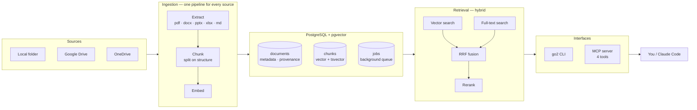

# Go2Assistant

Ask questions about your own documents and get answers with citations back to the exact page or section.

Point it at a folder, Google Drive, or OneDrive. It parses, indexes, and serves the result to any MCP client — so Claude Code becomes the interface and there is no UI to build.

```bash
go2 ingest ~/Documents/work
go2 search "how much did we agree to pay Acme?"
```

```
1. Acme Master Services Agreement.pdf p.1   [1.01]
   The annual renewal fee is 4,500 USD, payable each March...
```

---

## Components



**Providers sit behind interfaces.** Embedding and reranking run either on-device (Qwen3 + a cross-encoder, nothing leaves the machine) or through the Jina API (roughly 9× faster, and the laptop stays idle). One config line switches them.

---

## Design decisions worth knowing

**Agentic search, not single-shot RAG.** Retrieval is exposed as tools and the model drives the loop, so it can rephrase a bad query, page through a document, and combine metadata filters with semantic search. "Which contracts expire this quarter?" is a metadata question no vector search can answer.

**Hybrid search, never vector-only.** Exact identifiers — invoice numbers, client names, filenames — are what embeddings are worst at and what people actually search for. Vector and full-text results are fused by Reciprocal Rank Fusion, then reranked.

**Citations are load-bearing.** Chunks never merge across a page, slide, or heading boundary. A chunk spanning pages 3 and 4 can only be cited as one of them, and a citation pointing at the wrong page is worse than a smaller chunk.

**Spreadsheets are never chunked as prose.** Each sheet is kept whole. Prose-chunking a budget destroys exactly the numbers the question is about.

**Nothing leaves the machine unscreened.** With a hosted provider, every chunk of every document is sent at ingest — a far larger surface than a chat message. One egress boundary screens all of it, masking card numbers, IBANs, API keys, national IDs, emails and phones. Detection is checksum-validated, so a sixteen-digit run identifier is not mistaken for a card. `go2 scan` reports what a folder contains before you index it.

**Vectors carry their provenance.** Embeddings from different models are not comparable, and mixing them fails silently — confident nonsense rather than an error. Each document records the model that produced it, and search scopes to the active one.

---

## Commands

| | |
|---|---|
| `go2 ingest PATH` | Index a folder (`--background` to queue it instead) |
| `go2 worker` | Drain the ingestion queue |
| `go2 search "..."` | Query from the terminal |
| `go2 docs` | Every ingested file (`--by-folder` to group) |
| `go2 status` | What is indexed, and which model embedded it |
| `go2 scan PATH` | Report sensitive values in files, without ingesting |
| `go2 evaluate` | Run `eval/questions.yaml`, report rank and MRR |
| `go2 serve` | MCP server on stdio |

---

## Setup

Requires Python 3.12, PostgreSQL 16+ with `pgvector`, and [uv](https://docs.astral.sh/uv/).

```bash
uv sync
uv tool install --editable .          # `go2` from any directory
cp .env.example ~/.config/go2/.env    # edit, then:
go2 migrate
```

Configuration is read from `~/.config/go2/.env`, then a project-local `.env` that overrides it. Running entirely on-device needs no keys at all.

Add `.mcp.json` to a project and restart Claude Code to ask questions in chat.

---

## Testing

```bash
uv run pytest                  # full suite
uv run pytest -m "not slow"    # skip the model-loading ones
go2 evaluate                   # retrieval quality against known answers
```

`go2 evaluate` is the one that matters over time. Retrieval regressions are silent — the system keeps returning confident-looking passages, just the wrong ones — so every bad answer should become a case in `eval/questions.yaml`.

Architecture rationale and working agreement: [`CLAUDE.md`](CLAUDE.md).
