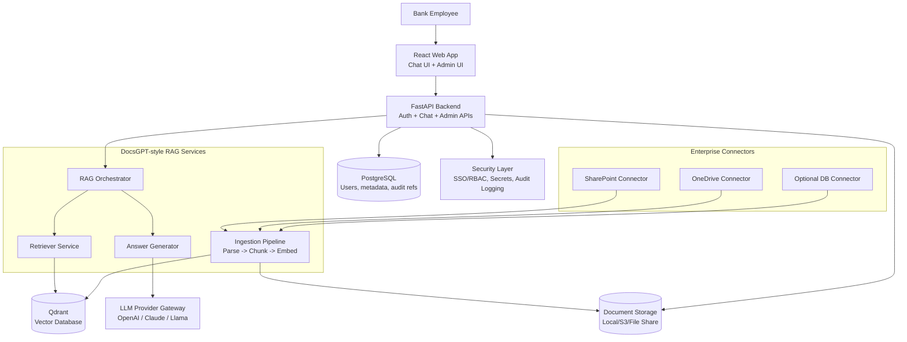

# Enterprise AI Knowledge Assistant for Banks — Understanding & Component Diagram

## 1) Verified Understanding

You want to build an **internal, secure, multilingual (Arabic/English) AI knowledge assistant** for bank employees that:

- Ingests enterprise documents (PDF, DOCX, XLSX, text).
- Retrieves policy/procedure knowledge from trusted internal sources.
- Answers user questions in chat with **grounded responses and source citations**.
- Supports on-prem/private-cloud deployment with enterprise controls.
- Starts with an MVP (upload + chat + RAG answers), then expands to integrations (OneDrive/SharePoint/DB), and then production hardening.

In short: this is an enterprise **RAG platform** optimized for internal banking operations and compliance use cases.

---

## 2) Scope Decomposition (What gets built)

### MVP (Phase 1)
- Web chat UI (React)
- Admin upload workflow
- Document extraction/chunking/indexing
- Vector search (Qdrant)
- Answer generation via LLM
- Citation of source document/section

### Enterprise Integration (Phase 2)
- Connectors: SharePoint/OneDrive
- Optional database knowledge connectors
- Sync/incremental indexing jobs

### Production (Phase 3)
- SSO/RBAC
- Auditing and observability
- Security hardening
- Scalable Docker/Linux deployment

---

## 3) Main Technology Choices

- **Frontend:** React (chat + admin dashboard)
- **Backend API:** FastAPI (Python)
- **RAG Orchestrator:** DocsGPT-style pipeline (ingestion + retrieval + generation)
- **Vector DB:** Qdrant
- **Relational DB:** PostgreSQL (users, metadata, settings, logs)
- **Object Storage/Files:** local volume, S3-compatible, or internal file share
- **Document Processing:** Python libraries for PDF/DOCX/XLSX parsing + chunking
- **LLM Provider Layer:** OpenAI / Claude / local model endpoint abstraction
- **Integrations:** Microsoft Graph APIs for OneDrive/SharePoint
- **Security:** Key management + access control + audit logs
- **Deployment:** Docker Compose (MVP), then Kubernetes/VM scaling as needed

---

## 4) Component Diagram (Main Technologies)



---

## 5) Request/Response Flow (Operational View)

1. Employee asks question in React chat.
2. FastAPI validates identity/permissions.
3. RAG orchestrator embeds query and retrieves top chunks from Qdrant.
4. Generator sends context + prompt to selected LLM.
5. Response returned with citations (document name/section/chunk).
6. Interaction metadata/audit record written to PostgreSQL.

---

## 6) Key Non-Functional Priorities for Banking

- **Security first:** private deployment, access controls, auditability.
- **Grounded answers:** strict retrieval context to reduce hallucination.
- **Multilingual quality:** Arabic + English retrieval and prompt handling.
- **Traceability:** every answer linked to source chunk/document.
- **Reliability:** monitoring, retries, health checks, backup strategy.

---

## 7) Immediate Next Build Steps

1. Scaffold FastAPI + React + Qdrant + PostgreSQL with Docker Compose.
2. Implement document upload + parsing + chunking + embeddings.
3. Build retrieval + answer endpoint with citation return format.
4. Add admin UI for document lifecycle.
5. Add baseline auth and audit logging.
6. Add Arabic/English prompt + retrieval tuning.

---

## 8) Easiest Component-by-Component Build Flow (Small MVP First)

To avoid system complexity early, build in **vertical slices** where each slice is shippable and testable.

### Slice 0 — Walking Skeleton (1–2 days)
Goal: prove end-to-end plumbing with mock data.

- React chat page with static input/output.
- FastAPI `/health` and `/chat` endpoint (hardcoded response).
- Docker Compose for FE + API only.

**Exit criteria:** A user can type in UI and receive a backend response.

### Slice 1 — Minimal RAG Core (MVP foundation)
Goal: first grounded answer with one uploaded document.

- Add admin upload endpoint (single file).
- Parse text + chunk (simple fixed-size chunking).
- Store vectors in Qdrant.
- Implement retrieve + generate path with citations.

**Exit criteria:** Ask a question and get answer + source snippet from uploaded file.

### Slice 2 — Reliability Basics
Goal: reduce MVP fragility without adding broad scope.

- PostgreSQL metadata tables (documents, chunks, chat logs).
- Basic job status tracking for ingestion (`queued`, `processing`, `done`, `failed`).
- Simple error handling + structured logs.

**Exit criteria:** Upload and chat flows are inspectable and debuggable.

### Slice 3 — Access + Governance Lite
Goal: add minimum enterprise controls.

- Basic auth (even temporary/internal) on admin routes.
- Audit trail for upload/search/answer events.
- Configurable prompt template with citation enforcement.

**Exit criteria:** You can show who uploaded what and what sources informed answers.

### Slice 4 — Multilingual and Quality Tuning
Goal: make Arabic/English useful in daily workflows.

- Language-aware chunking/prompt rules.
- Retrieval tuning (top-k, score threshold, rerank optional).
- Evaluation set with 20–30 internal Q&A checks.

**Exit criteria:** Acceptable answer quality in both Arabic and English on known questions.

### Slice 5 — Connectors (Only After Core Is Stable)
Goal: automate ingestion from enterprise systems.

- Add OneDrive or SharePoint connector first (pick one).
- Run incremental sync schedule.
- Reuse same ingestion pipeline (no parallel ingestion logic).

**Exit criteria:** Connector docs appear in the same searchable index with citations.

### Golden Rule to Prevent Mess

For each slice, only introduce:
1. **One new infrastructure dependency** maximum.
2. **One new user-visible capability** maximum.
3. **One explicit success metric** (e.g., citation coverage %, ingestion success rate).

If a change cannot be demoed end-to-end in under a week, split it again.

---

## 9) Milestone-by-Milestone Technology Stack, Components, and Deliverables

This view maps each slice to the exact stack introduced, the components affected, and the concrete functionality delivered.

| Milestone | Stack Added/Activated | Components Affected | Deliverable Functionality |
|---|---|---|---|
| **Slice 0 — Walking Skeleton** | React, FastAPI, Docker Compose (minimal services) | `frontend/chat-shell`, `backend/chat-api`, `ops/docker-compose` | Chat UI sends request to backend and renders a simple response (no RAG yet). |
| **Slice 1 — Minimal RAG Core** | + Qdrant, embedding model/client, document parser libs | `backend/ingestion`, `backend/retrieval`, `backend/generation`, `vector-store` | Upload one document, index it, ask question, get grounded answer with citation/snippet. |
| **Slice 2 — Reliability Basics** | + PostgreSQL, structured logging | `metadata-store`, `ingestion-jobs`, `chat-logs`, `observability/logging` | Track document/chunk metadata, ingestion status, and chat traces for debugging/operations. |
| **Slice 3 — Access & Governance Lite** | + Auth middleware, audit event schema | `auth`, `admin-routes`, `audit-pipeline`, `prompt-config` | Protected admin actions and auditable upload/search/answer events with citation policy controls. |
| **Slice 4 — Multilingual Quality** | + language-aware tokenization/chunking, retrieval tuning config, evaluation harness | `chunker`, `retriever-ranking`, `prompting`, `eval-suite` | Better Arabic/English retrieval and answer quality with measurable acceptance checks. |
| **Slice 5 — Enterprise Connectors** | + Microsoft Graph connector (start with one), scheduler/worker | `connectors/<provider>`, `sync-orchestrator`, `ingestion-reuse` | Incremental sync from enterprise source into same index and same citation-capable chat flow. |

### Recommended Modular Code Layout (Scalable + Easy to Dissect)

Use clear module boundaries so each slice mostly touches one area and avoids cross-coupled refactors:

```text
/backend
  /api                 # FastAPI routers (chat, admin, health)
  /auth                # authn/authz policies + guards
  /rag
    /ingestion         # parse -> chunk -> embed
    /retrieval         # vector search + filtering
    /generation        # prompt assembly + LLM calls
  /connectors          # onedrive/sharepoint adapters
  /storage
    /vector            # Qdrant abstraction
    /relational        # PostgreSQL repositories
    /object            # file storage abstraction
  /audit               # event contracts + writers
  /jobs                # background workers/schedulers
  /config              # environment + feature flags

/frontend
  /features/chat
  /features/admin
  /shared/ui
  /shared/api-client
```

### Design Rules for Maintainability

1. **Contract-first APIs:** Define request/response schemas before implementation for each slice.
2. **Ports and adapters:** Keep provider-specific code behind interfaces (LLM, vector DB, connectors, storage).
3. **Single ingestion pipeline:** All sources (upload/connector) must call the same parse/chunk/embed flow.
4. **Feature flags per slice:** New capabilities (auth, reranking, connectors) are toggleable and reversible.
5. **Observability by default:** Every slice emits logs/metrics/events needed to debug that slice independently.

### Minimal Definition of Done Per Milestone

- Demoable end-to-end in a single environment.
- One-page runbook update (how to run, configure, troubleshoot).
- At least one smoke test for the new slice.
- No breaking changes to prior slice user flow.
