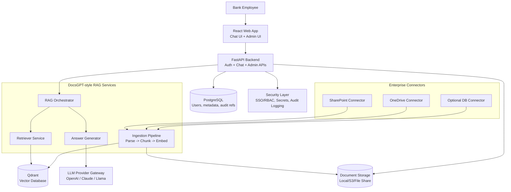

# Enterprise AI Knowledge Assistant for Banks — Understanding & Component Diagram

## 1) Verified Understanding

You want to build an **internal, secure, multilingual (Arabic/English) AI knowledge assistant** for bank employees that:

- Ingests enterprise documents (PDF, DOCX, XLSX, text).
- Retrieves policy/procedure knowledge from trusted internal sources.
- Answers user questions in chat with **grounded responses and source citations**.
- Supports on-prem/private-cloud deployment with enterprise controls.
- Starts with an MVP (upload + chat + RAG answers), then expands to integrations (OneDrive/SharePoint/DB), and then production hardening.

In short: this is an enterprise **RAG platform** optimized for internal banking operations and compliance use cases.

---

## 2) Scope Decomposition (What gets built)

### MVP (Phase 1)
- Web chat UI (React)
- Admin upload workflow
- Document extraction/chunking/indexing
- Vector search (Qdrant)
- Answer generation via LLM
- Citation of source document/section

### Enterprise Integration (Phase 2)
- Connectors: SharePoint/OneDrive
- Optional database knowledge connectors
- Sync/incremental indexing jobs

### Production (Phase 3)
- SSO/RBAC
- Auditing and observability
- Security hardening
- Scalable Docker/Linux deployment

---

## 3) Main Technology Choices

- **Frontend:** React (chat + admin dashboard)
- **Backend API:** FastAPI (Python)
- **RAG Orchestrator:** DocsGPT-style pipeline (ingestion + retrieval + generation)
- **Vector DB:** Qdrant
- **Relational DB:** PostgreSQL (users, metadata, settings, logs)
- **Object Storage/Files:** local volume, S3-compatible, or internal file share
- **Document Processing:** Python libraries for PDF/DOCX/XLSX parsing + chunking
- **LLM Provider Layer:** OpenAI / Claude / local model endpoint abstraction
- **Integrations:** Microsoft Graph APIs for OneDrive/SharePoint
- **Security:** Key management + access control + audit logs
- **Deployment:** Docker Compose (MVP), then Kubernetes/VM scaling as needed

---

## 4) Component Diagram (Main Technologies)

---

## 5) Request/Response Flow (Operational View)

1. Employee asks question in React chat.
2. FastAPI validates identity/permissions.
3. RAG orchestrator embeds query and retrieves top chunks from Qdrant.
4. Generator sends context + prompt to selected LLM.
5. Response returned with citations (document name/section/chunk).
6. Interaction metadata/audit record written to PostgreSQL.

---

## 6) Key Non-Functional Priorities for Banking

- **Security first:** private deployment, access controls, auditability.
- **Grounded answers:** strict retrieval context to reduce hallucination.
- **Multilingual quality:** Arabic + English retrieval and prompt handling.
- **Traceability:** every answer linked to source chunk/document.
- **Reliability:** monitoring, retries, health checks, backup strategy.

---

## 7) Immediate Next Build Steps

1. Scaffold FastAPI + React + Qdrant + PostgreSQL with Docker Compose.
2. Implement document upload + parsing + chunking + embeddings.
3. Build retrieval + answer endpoint with citation return format.
4. Add admin UI for document lifecycle.
5. Add baseline auth and audit logging.
6. Add Arabic/English prompt + retrieval tuning.

